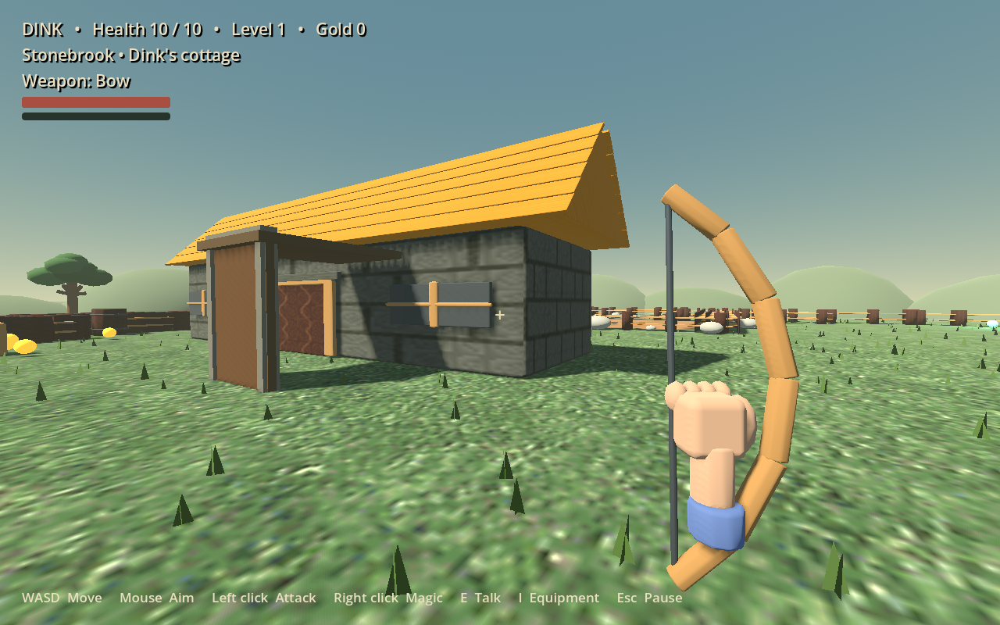

# Dink Smallwood 3D

An unofficial, first-person Godot 4 adaptation of *Dink Smallwood*, made by
[PilferedParrot](https://github.com/PilferedParrot). It uses the original
campaign data, ground art, dialogue, and FreeDink replacement audio alongside a
new 3D renderer, modeled scenery, mouse and controller controls, and first-person
combat.

This is version 0.3.1, a work in progress. It is a development release, not a finished remake. The
opening through Aunt Maria's letter and world map has been exercised in a
continuous automated route. All 644 map areas are imported, but a complete
start-to-finish playthrough has not been certified. See the
[0.3.1 release notes](docs/RELEASE_NOTES_0.3.1.md) (with the known issues), the
[0.3.0 release notes](docs/RELEASE_NOTES_0.3.0.md), [what changed in M3](docs/M3.md),
the [0.2.0 release notes](docs/RELEASE_NOTES_0.2.0.md) and the
[first-person implementation notes](docs/FIRST_PERSON.md).



## Play on Linux or Windows

Download the version 0.3.1 archive for your platform, extract it, and run:

| Platform | File |
| --- | --- |
| Linux x86-64 | [dink-smallwood-3d-0.3.1-linux-x86_64.zip](https://github.com/PilferedParrot/dink-smallwood-3d/releases/download/v0.3.1/dink-smallwood-3d-0.3.1-linux-x86_64.zip) → `DinkSmallwood3D.x86_64` |
| Windows x86-64 | [dink-smallwood-3d-0.3.1-windows-x86_64.zip](https://github.com/PilferedParrot/dink-smallwood-3d/releases/download/v0.3.1/dink-smallwood-3d-0.3.1-windows-x86_64.zip) → `DinkSmallwood3D.exe` |

The game runs offline and does not need an account. Saves and settings are kept
in Godot's application-data directory, separate from the extracted game folder.
Use **Pause → Save adventure**. Saving is unavailable while a scripted
conversation is in progress.

From a source checkout, install Godot 4.6.1 and run `./play.sh`. You can set
`GODOT=/path/to/godot` if Godot is not on your `PATH`.

## Controls

| Action | Keyboard and mouse | Controller |
| --- | --- | --- |
| Move and look | WASD and mouse | Left and right sticks |
| Attack | Left mouse | Right trigger / X |
| Magic | Right mouse or Q | Left trigger / Y |
| Talk / confirm | E or Enter | A |
| Jump / sprint | Space / Shift | Right / left stick click |
| Equipment / quick slots | I; 1–9 | Back / Select; LB / RB |
| Pause | Escape | Start |
| World map, once received | M | Start → World map |

Controller labels use the Xbox layout. Other Godot-recognized controllers use
the corresponding button positions. Settings include field of view, mouse and
stick sensitivity, dead zone, inverted vertical look, audio levels, and reduced
camera movement.

## Build and verify

The generated game data and assets are included, so Python, FreeDink, and Blender
are not required to play. For development:

```sh
python3 -m venv .venv
.venv/bin/python -m pip install -r requirements-dev.txt
export GODOT=/path/to/godot
"$GODOT" --headless --path game --editor --import
.venv/bin/python -m pytest -q
"$GODOT" --headless --path game -- --smoke-test
```

Godot 4.6.1 export templates are needed for release builds:

```sh
mkdir -p builds/linux builds/windows
"$GODOT" --headless --path game --export-release Linux
"$GODOT" --headless --path game --export-release Windows
python3 tools/package_release.py
```

To regenerate the 3D asset library, use
`blender --background --python tools/build_3d_assets.py`. The editable Blender
file is `art/dink_asset_library.blend` and generated models are in
`game/assets/models/`.

To reimport original game data on Debian or Ubuntu with `freedink-data`
installed:

```sh
python3 tools/import_assets.py /usr/share/games/dink/dink
python3 tools/compile_story.py /usr/share/games/dink/dink/Story --overrides tools/dialogue_overrides.json
```

## Credits and licenses

New implementation code is Apache-2.0. Original *Dink Smallwood* is by Seth A.
Robinson, with artwork by Justin Martin and story and world contributions from
Greg Smith, Chris Bakker, and others listed in [NOTICE](NOTICE). The music and
22 sound effects are GNU FreeDink's free set. The 27 sound effects FreeDink has
no replacement for, and leaves silent, are filled with free sounds: CC0, public
domain and CC BY 3.0 recordings, and one synthesized sound, built by
`tools/build_sfx.py`. The original sounds and music that RTsoft could not
release freely are not included. Per-file authors, sources and licenses are in
[licenses/AUDIO-FILES.tsv](licenses/AUDIO-FILES.tsv); see
[the audio notes](docs/AUDIO_FREEDINK_SWAP.md). Third-party art, campaign data,
music, and sound retain their own licenses; see [licenses/](licenses/).

This project is not endorsed by Robinson Technologies, GNU FreeDink, or Godot.

[Source](https://github.com/PilferedParrot/dink-smallwood-3d) ·
[Issues](https://github.com/PilferedParrot/dink-smallwood-3d/issues) ·
[Patreon](https://www.patreon.com/PilferedParrot)
