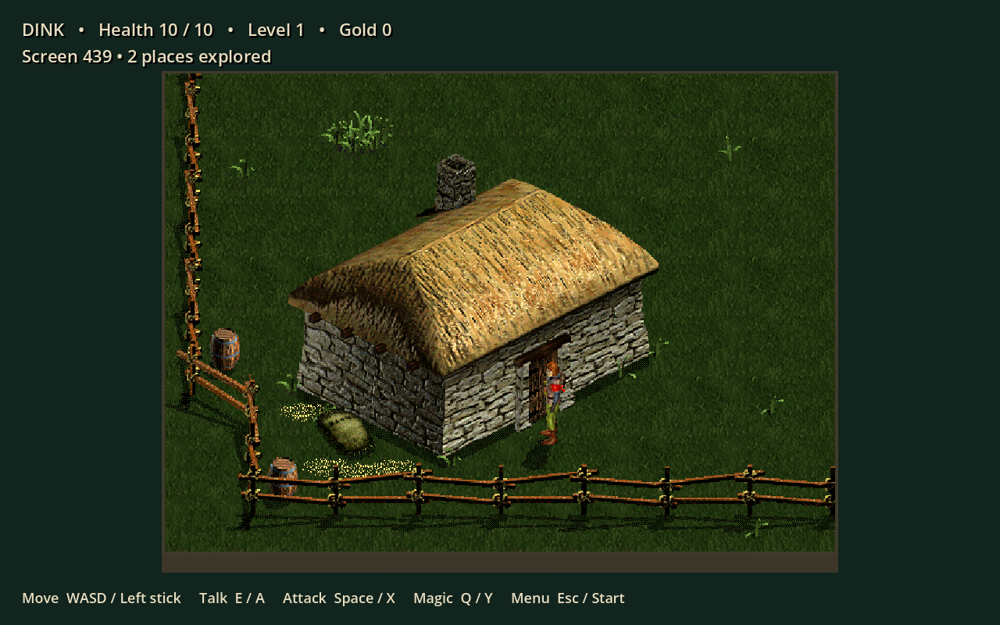

# Dink Smallwood 3D

An unofficial Godot adaptation by **[PilferedParrot](https://github.com/PilferedParrot)**.
Dink's original artwork and animations become a 3D diorama, with an adjustable
camera, larger menus, controller navigation, save/load, an adventure journal, and
revised dialogue. Music and effects come from the freely licensed FreeDink data.

**Development version 0.1.** This is an active campaign port. The full original
world and campaign scripts are imported; an uninterrupted start-to-finish
playthrough has not been certified. Characters and scenery use the original
rendered sprite frames in a 3D scene, rather than newly modeled characters.
See [implementation notes](docs/IMPLEMENTATION.md) and
[script coverage](docs/DINKC_SUPPORT.md).

[Support our work on Patreon](https://www.patreon.com/PilferedParrot) ·
[Downloads](https://github.com/PilferedParrot/dink-smallwood-3d/releases) ·
[Report a problem](https://github.com/PilferedParrot/dink-smallwood-3d/issues)



## Play

Download a release archive, extract the folder, and run `DinkSmallwood3D.x86_64`
on Linux or `DinkSmallwood3D.exe` on Windows. The game runs offline and needs no
account. Patreon and source links open your browser only when selected.

From this checkout, install **Godot 4.6.1** and run `./play.sh`, or import
`game/project.godot` in the editor. Set `GODOT=/path/to/godot` if needed.

| Action | Keyboard | Controller |
| --- | --- | --- |
| Move | WASD / arrows | Left stick |
| Talk / confirm | E / Enter | A / bottom face button |
| Attack / use equipped item | Space | X / left face button |
| Magic | Q | Y / top face button |
| Equipment | I | Back / Select |
| Pause | Escape | Start |
| Camera elevation | R | Right stick click |
| Menus | Arrows, Enter, Escape | D-pad / left stick, A, B |

Use **Pause → Save adventure** to save. Saves and settings use Godot's application
data directory, independently of the installation folder. Saving during a scripted
conversation is disabled to avoid losing an unfinished interaction.

## Build and verify

The generated game data and assets are included. Python, FreeDink, and Blender
are not needed to play. To rebuild imported data on Debian/Ubuntu with the
`freedink-data` package installed:

```sh
python3 tools/import_assets.py /usr/share/games/dink/dink
python3 tools/compile_story.py /usr/share/games/dink/dink/Story --overrides tools/dialogue_overrides.json
```

MIDI conversion uses FluidSynth, FFmpeg, and a General MIDI soundfont; use
`--soundfont /path/to/font.sf2` to select one. The music sources and their
attributions accompany the project.

```sh
python3 -m venv .venv
.venv/bin/python -m pip install -r requirements-dev.txt
export GODOT=/path/to/godot
"$GODOT" --headless --path game --editor --import
.venv/bin/python -m pytest -q
"$GODOT" --headless --path game -- --smoke-test
```

Godot export templates matching 4.6.1 are required to build executables:

```sh
mkdir -p builds/linux builds/windows
"$GODOT" --headless --path game --export-release Linux
"$GODOT" --headless --path game --export-release Windows
```

Distribute `LICENSE`, `NOTICE`, `licenses/`, and `third_party/` with executables.

## Dialogue and attribution

[Dialogue changes](docs/DIALOGUE_CHANGES.md) remove targeted gendered insults,
sexual harassment, incest jokes, and victim-blaming. Exact replacements are
scoped to individual scripts and recorded in the compiler report.

New implementation code is **Apache-2.0**, matching PilferedParrot Interface.
You may use, modify, and redistribute it, including commercially, under that
license. Retain the license and required attribution notices. Supporting the
project is optional.

Original Dink Smallwood is by **Seth A. Robinson**, with artwork by **Justin Martin**
and story/world contributions from **Greg Smith**, **Chris Bakker**, and others
listed in [NOTICE](NOTICE). GNU FreeDink contributors supplied free audio
replacements. Third-party art, campaign data, music, and sound retain their own
licenses; Apache-2.0 does not replace them. See [licenses/](licenses/).

This project is not endorsed by Robinson Technologies, GNU FreeDink, or Godot.
